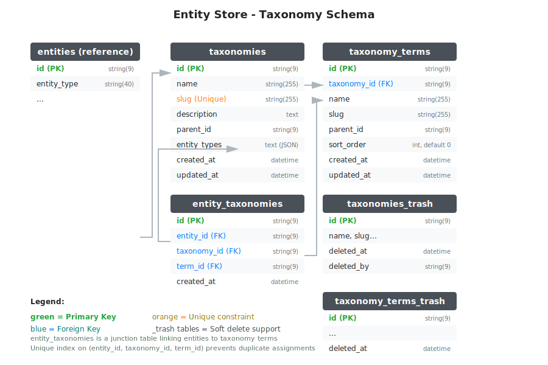

# Entity Store


[](https://goreportcard.com/report/github.com/dracory/entitystore)
[](https://pkg.go.dev/github.com/dracory/entitystore)

Modern "schemaless" storage using a relational (SQL) database. Document database interface for relational databases.

## Overview

Entity Store provides a flexible **EAV (Entity-Attribute-Value)** pattern for Go applications. Store schemaless data while keeping the benefits of relational databases: ACID transactions, SQL queries, and indexing.

## Database Schema

### Core EAV Structure


### Optional Features

 

## Documentation

| Guide | Description |
|-------|-------------|
| [Getting Started](docs/getting-started.md) | Installation, setup, and first steps |
| [Entities](docs/entities.md) | Creating, reading, updating, deleting entities |
| [Attributes](docs/attributes.md) | Working with typed attributes |
| [Relationships](docs/entity-relationships.md) | Linking entities together |
| [Taxonomies](docs/taxonomies.md) | Categorizing entities |
| [Pros & Cons](docs/pros-and-cons.md) | When to use and when not to |
| [Architecture](docs/architecture.md) | Design patterns and database schema |
| [API Reference](docs/api-reference.md) | Complete method reference |

## Quick Start

### Installation

```bash
go get -u github.com/dracory/entitystore
```

### Basic Setup

```go
store, err := entitystore.NewStore(entitystore.NewStoreOptions{
    DB:                 db,
    EntityTableName:    "entities",
    AttributeTableName: "attributes",
    AutomigrateEnabled: true,
})
```

### Create & Retrieve Entities

```go
// Create
person := store.EntityCreateWithType("person")
person.SetString("name", "John Doe")
person.SetInt("age", 30)
store.EntityCreate(ctx, person)

// Retrieve
found, _ := store.EntityFindByID(ctx, person.ID())
name := found.GetString("name", "Unknown")
```

## Features

- **EAV Pattern** - Flexible schemaless storage without JSON blobs
- **Typed Attributes** - String, Int, Float, and JSON-serializable interfaces
- **Soft Deletes** - Trash bin with restore capability for all entities
- **Entity Relationships** - Link entities (belongs_to, has_many, many_to_many)
- **Taxonomies** - Categorize entities with hierarchical terms
- **SQL Native** - Full SQL access for complex queries

## Optional Features

Enable advanced features via configuration:

```go
entitystore.NewStoreOptions{
    DB:                   db,
    EntityTableName:      "entities",
    AttributeTableName:   "attributes",
    RelationshipsEnabled: true,  // Enable relationships
    TaxonomiesEnabled:    true,  // Enable taxonomies
    AutomigrateEnabled:   true,
}
```

| Feature | Flag | Description |
|---------|------|-------------|
| Relationships | `RelationshipsEnabled` | Link entities together |
| Taxonomies | `TaxonomiesEnabled` | Categorize entities |

## Similar Projects

- [YesSQL](https://github.com/sebastienros/yessql) (.NET)
- [go-sqlkv](https://github.com/laurent22/go-sqlkv) (Go)

## License

MIT License - see [LICENSE](LICENSE) for details.
