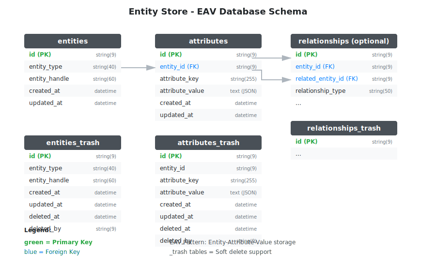

# Entity Store


[](https://goreportcard.com/report/github.com/dracory/entitystore)
[](https://pkg.go.dev/github.com/dracory/entitystore)

Modern "schemaless" storage using a relational (SQL) database. Document database interface for relational databases. 

## Features
- Ultimate flexibility and convenience, no schema changes
- Implemented via an EAV (entity-attribute-value) pattern to keep the relational structure and avoid blobs (JSON) fields
- Single store can store unlimited number of entities of any type
- Single store can store unlimited number of attributes for each entity
- Multiple stores can be used to store specific types
- Attributes can store any type of data - strings, integers, floating point numbers, any interfaces
- **Entity Relationships** - Link entities together (belongs_to, has_many, many_to_many) with optional hierarchical support
- **Entity Taxonomies** - Categorize entities with hierarchical taxonomies (categories, tags, labels) with full referential integrity
- 99% of required storage functionality provided out of the box
- Full SQL available for more sophisticated cases - reporting, diagrams, etc.
- Supports soft deletes via separate trash bin tables

## Installation
```
go get -u github.com/dracory/entitystore
```

## Setup

### Basic Setup (Entities and Attributes)

```golang
entityStore, err := NewStore(NewStoreOptions{
	DB:                 db,
	EntityTableName:    "entities_entity",
	AttributeTableName: "entities_attribute",
	AutomigrateEnabled: true,
})
```

### Setup with Relationships (Optional)

Enable entity relationships by setting `RelationshipsEnabled: true`. See [docs/entity-relationships.md](docs/entity-relationships.md) for full documentation.

```golang
entityStore, err := NewStore(NewStoreOptions{
	DB:                   db,
	EntityTableName:      "entities_entity",
	AttributeTableName:   "entities_attribute",
	RelationshipsEnabled: true,  // Enable relationships
	AutomigrateEnabled:   true,
})
```

### Setup with Taxonomies (Optional)

Enable entity taxonomies by setting `TaxonomiesEnabled: true`. See [docs/proposals/2026-03-28-entity-taxonomy.md](docs/proposals/2026-03-28-entity-taxonomy.md) for full documentation.

```golang
entityStore, err := NewStore(NewStoreOptions{
	DB:                 db,
	EntityTableName:    "entities_entity",
	AttributeTableName: "entities_attribute",
	TaxonomiesEnabled:  true,  // Enable taxonomies
	AutomigrateEnabled: true,
})
```

## Usage

1. Create a new entity
```golang
person := entityStore.EntityCreateWithType("person")
person.SetString("name","Jon Doe")
person.SetInt("age", 32)
person.SetFloat("salary", 1234.56)
person.SetInterface("kids", []string{"Tina","Sam"})
```

2. Retrieve an entity
```golang
personID := "{THE PERSON ID}"
person := entityStore.EntityFindByID(personID)
person.GetString("name")
person.GetInt("age")
person.GetFloat("salary")
person.GetInterface("kids")
```

### 3. Entity Relationships (Optional)

Link entities with `belongs_to`, `has_many`, or `many_to_many` relationships. See [docs/entity-relationships.md](docs/entity-relationships.md) for full documentation.

```golang
// Create relationship
store.RelationshipCreateByOptions(ctx, RelationshipOptions{
    EntityID:         book.ID(),
    RelatedEntityID:  author.ID(),
    RelationshipType: RELATIONSHIP_TYPE_BELONGS_TO,
})

// Query relationships
relationships, _ := store.RelationshipListRelated(ctx, author.ID(), RELATIONSHIP_TYPE_BELONGS_TO)
```

### 4. Entity Taxonomies (Optional)

Categorize entities with hierarchical taxonomies. See [docs/proposals/2026-03-28-entity-taxonomy.md](docs/proposals/2026-03-28-entity-taxonomy.md) for full documentation.

```golang
// Create taxonomy
categories, _ := store.TaxonomyCreateByOptions(ctx, TaxonomyOptions{
    Name:        "Product Categories",
    Slug:        "product_categories",
    EntityTypes: []string{"product"},
})

// Create taxonomy term
electronics, _ := store.TaxonomyTermCreateByOptions(ctx, TaxonomyTermOptions{
    TaxonomyID: categories.ID(),
    Name:       "Electronics",
    Slug:       "electronics",
})

// Assign entity to taxonomy term
store.EntityTaxonomyAssign(ctx, product.ID(), categories.ID(), electronics.ID())

// Query entities by taxonomy
assignments, _ := store.EntityTaxonomyList(ctx, EntityTaxonomyQueryOptions{
    TaxonomyID: categories.ID(),
    TermID:     electronics.ID(),
})
```


## Database Schema



## Documentation

| Topic | Link |
|-------|------|
| **Entities** | [docs/entities.md](docs/entities.md) - Creating, updating, deleting entities |
| **Attributes** | [docs/attributes.md](docs/attributes.md) - Working with typed attributes |
| **Relationships** | [docs/entity-relationships.md](docs/entity-relationships.md) - Linking entities together |
| **Taxonomies** | [docs/proposals/2026-03-28-entity-taxonomy.md](docs/proposals/2026-03-28-entity-taxonomy.md) - Categorizing entities with hierarchical taxonomies |

## Methods Overview

These methods may be subject to change. See documentation links above for complete API reference.

### Entity Store Methods

- `EntityCreateWithType(type string)` - Create new entity
- `EntityFindByID(ctx, id string)` - Find entity by ID
- `EntityList(ctx, opts)` - List entities
- `EntityUpdate(ctx, entity)` - Update entity
- `EntityDelete(ctx, id)` / `EntityTrash(ctx, id)` - Delete / Soft delete

### Attribute Store Methods

- `AttributeSetString(ctx, entityID, key, value)` - Set string attribute
- `AttributeSetInt(ctx, entityID, key, value)` - Set int attribute
- `AttributeSetFloat(ctx, entityID, key, value)` - Set float attribute
- `AttributeSetInterface(ctx, entityID, key, value)` - Set JSON attribute
- `AttributeFind(ctx, entityID, key)` - Find attribute

### Relationship Store Methods (requires `RelationshipsEnabled: true`)

- `RelationshipCreateByOptions(ctx, options)` - Create relationship
- `RelationshipList(ctx, options)` - List relationships
- `RelationshipListRelated(ctx, relatedID, type)` - List by related entity

### Taxonomy Store Methods (requires `TaxonomiesEnabled: true`)

- `TaxonomyCreateByOptions(ctx, options)` - Create taxonomy
- `TaxonomyFind(ctx, id)` / `TaxonomyFindBySlug(ctx, slug)` - Find taxonomy
- `TaxonomyList(ctx, options)` - List taxonomies
- `TaxonomyUpdate(ctx, taxonomy)` - Update taxonomy
- `TaxonomyDelete(ctx, id)` / `TaxonomyTrash(ctx, id, deletedBy)` - Delete / Soft delete
- `TaxonomyTermCreateByOptions(ctx, options)` - Create taxonomy term
- `TaxonomyTermFind(ctx, id)` / `TaxonomyTermFindBySlug(ctx, taxonomyID, slug)` - Find term
- `TaxonomyTermList(ctx, options)` - List terms
- `EntityTaxonomyAssign(ctx, entityID, taxonomyID, termID)` - Assign entity to term
- `EntityTaxonomyRemove(ctx, entityID, taxonomyID, termID)` - Remove assignment
- `EntityTaxonomyList(ctx, options)` - List entity-taxonomy assignments

## Similar Packages
- https://github.com/sebastienros/yessql (.NET)
- https://github.com/laurent22/go-sqlkv (GO)
- https://github.com/greensea/sqljsondb
