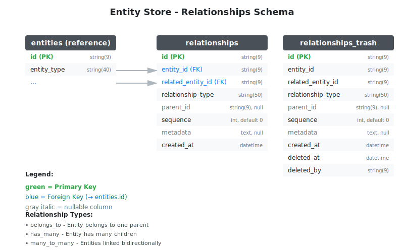

# Entity Relationships

Entity relationships allow you to link entities together using different relationship types (belongs_to, has_many, many_to_many). This feature is optional and disabled by default.

## Database Schema



## Setup

```go
store, err := entitystore.NewStore(entitystore.NewStoreOptions{
    DB:                      db,
    EntityTableName:         "entities_entity",
    AttributeTableName:      "entities_attribute",
    RelationshipsEnabled:    true,                         // Enable relationship support
    RelationshipTableName:     "entities_relationships",     // Optional: custom table name
    AutomigrateEnabled:      true,
})
```

## Relationship Types

| Type | Description |
|------|-------------|
| `RELATIONSHIP_TYPE_BELONGS_TO` | Entity belongs to one parent |
| `RELATIONSHIP_TYPE_HAS_MANY` | Entity has many children |
| `RELATIONSHIP_TYPE_MANY_MANY` | Entities linked bidirectionally |

## Basic Usage

### Create a Relationship

```go
// Create entities
author := store.EntityCreateWithType("author")
author.SetString("name", "John Doe")

book := store.EntityCreateWithType("book")
book.SetString("title", "Go Programming")

// Link book to author
rel, _ := store.RelationshipCreateByOptions(ctx, entitystore.RelationshipOptions{
    EntityID:         book.ID(),
    RelatedEntityID:  author.ID(),
    RelationshipType: entitystore.RELATIONSHIP_TYPE_BELONGS_TO,
})
```

### Query Relationships

```go
// Find all books by author
relationships, _ := store.RelationshipListRelated(ctx, author.ID(), entitystore.RELATIONSHIP_TYPE_BELONGS_TO)
for _, rel := range relationships {
    book, _ := store.EntityFindByID(ctx, rel.EntityID())
    fmt.Println(book.GetString("title"))
}
```

## Hierarchical Relationships

Use `parent_id` and `sequence` for tree structures:

```go
// Create nested categories
electronics := store.EntityCreateWithType("category")
electronics.SetString("name", "Electronics")

phones := store.EntityCreateWithType("category")
phones.SetString("name", "Phones")

// Create relationship with parent_id
store.RelationshipCreateByOptions(ctx, entitystore.RelationshipOptions{
    EntityID:         phones.ID(),
    RelatedEntityID:  electronics.ID(),
    RelationshipType: entitystore.RELATIONSHIP_TYPE_BELONGS_TO,
    ParentID:         relElectronics.ID(),  // Child of electronics
    Sequence:         1,                     // Order within parent
})
```

## Store Methods

### CRUD Operations

- `RelationshipCreate(ctx, relationship RelationshipInterface) error`
- `RelationshipCreateByOptions(ctx, options RelationshipOptions) (RelationshipInterface, error)`
- `RelationshipFind(ctx, relationshipID string) (RelationshipInterface, error)`
- `RelationshipFindByEntities(ctx, entityID, relatedEntityID, relationshipType string) (RelationshipInterface, error)`
- `RelationshipList(ctx, options RelationshipQueryOptions) ([]RelationshipInterface, error)`
- `RelationshipListRelated(ctx, relatedEntityID string, relationshipType string) ([]RelationshipInterface, error)`
- `RelationshipCount(ctx, options RelationshipQueryOptions) (int64, error)`
- `RelationshipDelete(ctx, relationshipID string) (bool, error)`
- `RelationshipDeleteAll(ctx, entityID string) error`

### Trash Operations

- `RelationshipTrash(ctx, relationshipID string, deletedBy string) (bool, error)`
- `RelationshipRestore(ctx, relationshipID string) (bool, error)`
- `RelationshipTrashList(ctx, options RelationshipQueryOptions) ([]RelationshipTrashInterface, error)`

## Relationship Object Methods

- `EntityID() string` / `SetEntityID(id string) RelationshipInterface`
- `RelatedEntityID() string` / `SetRelatedEntityID(id string) RelationshipInterface`
- `RelationshipType() string` / `SetRelationshipType(t string) RelationshipInterface`
- `ParentID() string` / `SetParentID(id string) RelationshipInterface`
- `Sequence() int` / `SetSequence(n int) RelationshipInterface`
- `Metadata() string` / `SetMetadata(json string) RelationshipInterface`
