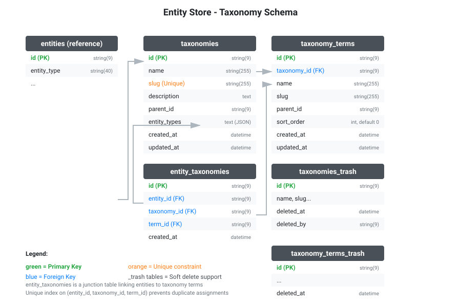

# Taxonomies

Categorize and classify entities using hierarchical taxonomies.

## Overview

Taxonomies allow you to organize entities into categories, tags, or any classification system:

- **Taxonomy** - A classification system (e.g., "Product Categories", "Blog Tags")
- **Taxonomy Term** - A specific category within a taxonomy (e.g., "Electronics", "Technology")
- **Entity Assignment** - Linking an entity to a taxonomy term

## Database Schema



## Setup

Enable taxonomies when creating the store:

```go
store, err := entitystore.NewStore(entitystore.NewStoreOptions{
    DB:                      db,
    EntityTableName:         "entities",
    AttributeTableName:      "attributes",
    TaxonomiesEnabled:       true,  // Enable taxonomies
    AutomigrateEnabled:      true,
})
```

## Taxonomy

A taxonomy defines a classification system for specific entity types.

### Create Taxonomy

```go
// Simple taxonomy
categories, err := store.TaxonomyCreateByOptions(ctx, entitystore.TaxonomyOptions{
    Name: "Product Categories",
    Slug: "product_categories",
})

// With entity type restriction
tags, err := store.TaxonomyCreateByOptions(ctx, entitystore.TaxonomyOptions{
    Name:        "Blog Tags",
    Slug:        "blog_tags",
    Description: "Tags for blog posts",
    EntityTypes: []string{"blog_post"}, // Only blog_post entities
})
```

### Find Taxonomy

```go
// By ID
taxonomy, err := store.TaxonomyFind(ctx, "tax123xyz")

// By slug (unique identifier)
taxonomy, err := store.TaxonomyFindBySlug(ctx, "product_categories")
```

### Update Taxonomy

```go
taxonomy, _ := store.TaxonomyFind(ctx, "tax123xyz")
taxonomy.SetName("Updated Categories")
taxonomy.SetDescription("New description")
store.TaxonomyUpdate(ctx, taxonomy)
```

### List Taxonomies

```go
// All taxonomies
taxonomies, err := store.TaxonomyList(ctx, entitystore.TaxonomyQuery().
    WithLimit(20))

// By entity type
productTaxonomies, err := store.TaxonomyList(ctx, entitystore.TaxonomyQuery().
    WithEntityType("product")) // Taxonomies applicable to products
```

### Delete Taxonomy

```go
// Soft delete (trash)
trashed, err := store.TaxonomyTrash(ctx, "tax123xyz", "user_id")

// Hard delete
deleted, err := store.TaxonomyDelete(ctx, "tax123xyz")

// Restore from trash
restored, err := store.TaxonomyRestore(ctx, "tax123xyz")
```

## Taxonomy Terms

Terms are the individual categories or labels within a taxonomy.

### Create Term

```go
// Create term in taxonomy
electronics, err := store.TaxonomyTermCreateByOptions(ctx, entitystore.TaxonomyTermOptions{
    TaxonomyID: categories.ID(),
    Name:       "Electronics",
    Slug:       "electronics",
})

// Hierarchical term (child of another term)
phones, err := store.TaxonomyTermCreateByOptions(ctx, entitystore.TaxonomyTermOptions{
    TaxonomyID: categories.ID(),
    ParentID:   electronics.ID(), // Child of Electronics
    Name:       "Smartphones",
    Slug:       "smartphones",
    SortOrder:  1, // Display order
})
```

### Find Term

```go
// By ID
term, err := store.TaxonomyTermFind(ctx, "term456abc")

// By slug within taxonomy
term, err := store.TaxonomyTermFindBySlug(ctx, categories.ID(), "electronics")
```

### List Terms

```go
// All terms in taxonomy
terms, err := store.TaxonomyTermList(ctx, entitystore.TaxonomyTermQuery().
    WithTaxonomyID(categories.ID()).
    WithLimit(50))

// Children of specific term
children, err := store.TaxonomyTermList(ctx, entitystore.TaxonomyTermQuery().
    WithTaxonomyID(categories.ID()).
    WithParentID(electronics.ID()))
```

### Update Term

```go
term, _ := store.TaxonomyTermFind(ctx, "term456abc")
term.SetName("Updated Name")
term.SetSortOrder(2)
store.TaxonomyTermUpdate(ctx, term)
```

### Delete Term

```go
// Soft delete
trashed, err := store.TaxonomyTermTrash(ctx, "term456abc", "user_id")

// Hard delete
deleted, err := store.TaxonomyTermDelete(ctx, "term456abc")

// Restore
restored, err := store.TaxonomyTermRestore(ctx, "term456abc")
```

## Entity Assignments

Assign entities to taxonomy terms for categorization.

### Assign Entity to Term

```go
// Assign product to Electronics category
err := store.EntityTaxonomyAssign(ctx, product.ID(), categories.ID(), electronics.ID())
if err != nil {
    // Handle error (e.g., assignment already exists)
}

// Assign to multiple terms
store.EntityTaxonomyAssign(ctx, product.ID(), categories.ID(), phones.ID())
store.EntityTaxonomyAssign(ctx, product.ID(), tags.ID(), featured.ID())
```

### Remove Assignment

```go
// Remove from specific term
err := store.EntityTaxonomyRemove(ctx, product.ID(), categories.ID(), electronics.ID())

// Remove from all terms in taxonomy
assignments, _ := store.EntityTaxonomyList(ctx, entitystore.EntityTaxonomyQuery().
    WithEntityID(product.ID()).
    WithTaxonomyID(categories.ID()))
for _, a := range assignments {
    store.EntityTaxonomyRemove(ctx, a.GetEntityID(), a.GetTaxonomyID(), a.GetTermID())
}
```

### Query Assignments

```go
// Find entities in term
assignments, err := store.EntityTaxonomyList(ctx, entitystore.EntityTaxonomyQuery().
    WithTaxonomyID(categories.ID()).
    WithTermID(electronics.ID()).
    WithLimit(20))

for _, a := range assignments {
    entity, _ := store.EntityFindByID(ctx, a.GetEntityID())
    name, _, _ := store.AttributeGetString(ctx, entity.ID(), "name")
    fmt.Println(name)
}

// Find all assignments for an entity
entityAssignments, err := store.EntityTaxonomyList(ctx, entitystore.EntityTaxonomyQuery().
    WithEntityID(product.ID()))

// Count entities in term
count, err := store.EntityTaxonomyCount(ctx, entitystore.EntityTaxonomyQuery().
    WithTaxonomyID(categories.ID()).
    WithTermID(electronics.ID()))
```

## Complete Example

```go
// Setup store with taxonomies enabled
store, _ := entitystore.NewStore(entitystore.NewStoreOptions{
    DB:                 db,
    EntityTableName:    "entities",
    AttributeTableName: "attributes",
    TaxonomiesEnabled:  true,
    AutomigrateEnabled: true,
})

ctx := context.Background()

// 1. Create taxonomy for products
categories, _ := store.TaxonomyCreateByOptions(ctx, entitystore.TaxonomyOptions{
    Name:        "Product Categories",
    Slug:        "product_categories",
    Description: "Main product categorization",
    EntityTypes: []string{"product"},
})

// 2. Create hierarchical terms
electronics, _ := store.TaxonomyTermCreateByOptions(ctx, entitystore.TaxonomyTermOptions{
    TaxonomyID: categories.ID(),
    Name:       "Electronics",
    Slug:       "electronics",
})

phones, _ := store.TaxonomyTermCreateByOptions(ctx, entitystore.TaxonomyTermOptions{
    TaxonomyID: categories.ID(),
    ParentID:   electronics.ID(),
    Name:       "Smartphones",
    Slug:       "smartphones",
    SortOrder:  1,
})

// 3. Create product entity
product, _ := store.EntityCreateWithType(ctx, "product")
store.AttributeSetString(ctx, product.ID(), "name", "iPhone 15")
store.AttributeSetFloat(ctx, product.ID(), "price", 999.99)

// 4. Assign to taxonomy terms
store.EntityTaxonomyAssign(ctx, product.ID(), categories.ID(), electronics.ID())
store.EntityTaxonomyAssign(ctx, product.ID(), categories.ID(), phones.ID())

// 5. Query products in category
assignments, _ := store.EntityTaxonomyList(ctx, entitystore.EntityTaxonomyQuery().
    WithTaxonomyID(categories.ID()).
    WithTermID(phones.ID()))

for _, a := range assignments {
    p, _ := store.EntityFindByID(ctx, a.GetEntityID())
    name, _, _ := store.AttributeGetString(ctx, p.ID(), "name")
    fmt.Printf("Product in Smartphones: %s\n", name)
}

// 6. Get all categories for product
productAssignments, _ := store.EntityTaxonomyList(ctx, entitystore.EntityTaxonomyQuery().
    WithEntityID(product.ID()))

for _, a := range productAssignments {
    term, _ := store.TaxonomyTermFind(ctx, a.GetTermID())
    fmt.Printf("Product is in: %s\n", term.GetName())
}
```

## Hierarchical Navigation

Navigate the taxonomy hierarchy:

```go
// Get parent term
if term.GetParentID() != "" {
    parent, _ := store.TaxonomyTermFind(ctx, term.GetParentID())
    fmt.Printf("Parent: %s\n", parent.GetName())
}

// Get all ancestors (up the tree)
func getTermAncestors(ctx context.Context, store entitystore.StoreInterface, termID string) ([]entitystore.TaxonomyTermInterface, error) {
    var ancestors []entitystore.TaxonomyTermInterface
    
    term, err := store.TaxonomyTermFind(ctx, termID)
    if err != nil || term == nil {
        return ancestors, err
    }
    
    current := term
    for current.GetParentID() != "" {
        parent, err := store.TaxonomyTermFind(ctx, current.GetParentID())
        if err != nil || parent == nil {
            break
        }
        ancestors = append([]entitystore.TaxonomyTermInterface{parent}, ancestors...)
        current = parent
    }
    
    return ancestors, nil
}

// Get all descendants (down the tree)
func getTermDescendants(ctx context.Context, store entitystore.StoreInterface, taxonomyID, termID string) ([]entitystore.TaxonomyTermInterface, error) {
    var descendants []entitystore.TaxonomyTermInterface
    
    children, err := store.TaxonomyTermList(ctx, entitystore.TaxonomyTermQuery().
        WithTaxonomyID(taxonomyID).
        WithParentID(termID))
    if err != nil {
        return descendants, err
    }
    
    for _, child := range children {
        descendants = append(descendants, child)
        childDescendants, _ := getTermDescendants(ctx, store, taxonomyID, child.ID())
        descendants = append(descendants, childDescendants...)
    }
    
    return descendants, nil
}
```

## Best Practices

1. **Use unique slugs** - Slugs are unique identifiers for taxonomies and terms
2. **Restrict entity types** - Use `EntityTypes` to prevent invalid assignments
3. **Validate before assigning** - Check entity exists before taxonomy assignment
4. **Handle hierarchy** - Parent terms should exist before creating children
5. **Soft delete first** - Use trash before hard delete to allow recovery
6. **Index frequently queried** - Terms accessed often benefit from caching

## Fluent Query Reference

List, count, and trash-list methods take fluent query interfaces
(`With*`/`Get*`/`Has*` methods plus `Validate()`; the store rejects nil or
invalid queries before executing).

### TaxonomyQuery()

`WithID`, `WithIDs`, `WithSlug`, `WithParentID`, `WithEntityType`,
`WithEntityTypes`, `WithLimit`, `WithOffset`, `WithSortBy`, `WithSortOrder`,
`WithCountOnly`, and inclusive UTC time bounds `WithCreatedAtGte/Lte` and
`WithUpdatedAtGte/Lte` in `"YYYY-MM-DD HH:MM:SS"` format.

### TaxonomyTermQuery()

`WithID`, `WithIDs`, `WithTaxonomyID`, `WithSlug`, `WithParentID`,
`WithLimit`, `WithOffset`, `WithSortBy`, `WithSortOrder`, `WithCountOnly`,
plus the same time-bound filters.

### EntityTaxonomyQuery()

`WithID`, `WithEntityID`, `WithEntityIDs`, `WithTaxonomyID`, `WithTermID`,
`WithTermIDs`, `WithLimit`, `WithOffset`, `WithSortBy`, `WithSortOrder`,
`WithCountOnly`, plus the same time-bound filters.

## Store Methods Reference

### Taxonomy Methods

| Method | Description |
|--------|-------------|
| `TaxonomyCreate(ctx, taxonomy)` | Create from object |
| `TaxonomyCreateByOptions(ctx, opts)` | Create with options |
| `TaxonomyFind(ctx, id)` | Find by ID |
| `TaxonomyFindBySlug(ctx, slug)` | Find by slug |
| `TaxonomyList(ctx, query)` | List taxonomies |
| `TaxonomyCount(ctx, query)` | Count matching |
| `TaxonomyUpdate(ctx, taxonomy)` | Update taxonomy |
| `TaxonomyDelete(ctx, id)` | Hard delete |
| `TaxonomyTrash(ctx, id, deletedBy)` | Soft delete |
| `TaxonomyRestore(ctx, id)` | Restore from trash |
| `TaxonomyTrashList(ctx, query)` | List trashed |

### Taxonomy Term Methods

| Method | Description |
|--------|-------------|
| `TaxonomyTermCreate(ctx, term)` | Create from object |
| `TaxonomyTermCreateByOptions(ctx, opts)` | Create with options |
| `TaxonomyTermFind(ctx, id)` | Find by ID |
| `TaxonomyTermFindBySlug(ctx, taxonomyID, slug)` | Find by slug |
| `TaxonomyTermList(ctx, query)` | List terms |
| `TaxonomyTermCount(ctx, query)` | Count matching |
| `TaxonomyTermUpdate(ctx, term)` | Update term |
| `TaxonomyTermDelete(ctx, id)` | Hard delete |
| `TaxonomyTermTrash(ctx, id, deletedBy)` | Soft delete |
| `TaxonomyTermRestore(ctx, id)` | Restore from trash |
| `TaxonomyTermTrashList(ctx, query)` | List trashed |

### Entity Taxonomy Methods

| Method | Description |
|--------|-------------|
| `EntityTaxonomyAssign(ctx, entityID, taxonomyID, termID)` | Assign entity to term |
| `EntityTaxonomyRemove(ctx, entityID, taxonomyID, termID)` | Remove assignment |
| `EntityTaxonomyList(ctx, query)` | List assignments |
| `EntityTaxonomyCount(ctx, query)` | Count assignments |
